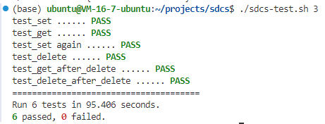

<!--
 * @Author: FoolishDominator 1340995873@qq.com
 * @Date: 2024-11-20 22:41:33
 * @LastEditors: FoolishDominator 1340995873@qq.com
 * @LastEditTime: 2024-11-22 00:50:14
 * @FilePath: /sdcs/readme.md
 * @Description: A Simple Distributed Cache System
-->
# SDCS: Simple Distributed Cache System
## 系统简介
该系统是一个简单的分布式缓存系统的实现，Cache数据以key-value的形式存储在缓存系统节点内存中，没有做持久化的操作。

服务启动若干存储节点，不考虑节点的动态变化，所有的节点均提供HTTP访问入口。客户端的每个请求只支持一个key存取，且可以从任意节点接入，如果数据所在目标存储器与接入服务器不同，则接入服务器会通过内部RPC向目标存储服务器发起相同操作请求，并将目标服务器结果返回客户端。

## 系统架构
SDCS每个节点分为两个模块：分别为Web服务器模块web_server和数据存储模块store_node。

web_server模块是一个使用Flask框架构建的简单的Web服务器，用于路由URL并转而与后端数据存储模块进行交互。该模块中主要定义了三个处理函数：Write, Read和Delete。以Write函数为例，当接收到HTTP POST请求时，会调用Write函数，从请求体中获取键值对，并将其包装成适当的 Protobuf 类型，通过 gRPC 存根发送到后端服务。简而言之，这个 Web 服务器提供了基本的 CRUD 操作接口，通过 gRPC 与后端分布式缓存系统进行交互

store_node模块用于接受web_server模块发来的键值对，根据键的MD5哈希值决定了该键值对应当存储于哪个节点。如果应由其他节点存储，则通过grpc远过程调用相应的处理函数进行CRUD操作；如果应由自身处理，简单存储该键值对于内存中即可。

## 具体实现
该项目基于docker打包，并且通过docker compose启动运行。本项目构建了3个cache server实例，用于简单演示分布式缓存系统的基本功能，三个server将内部HTTP服务端口映射至Host，外部端口从9527递增，通过 http://127.0.0.1:9527, http://127.0.0.1:9528, http://127.0.0.1:9529 即可访问3个cache server

## 运行方法
```bash
cd sdcs
docker compose build
docker compose up -d
./sdcs-test.sh 3
```

## 测试结果
